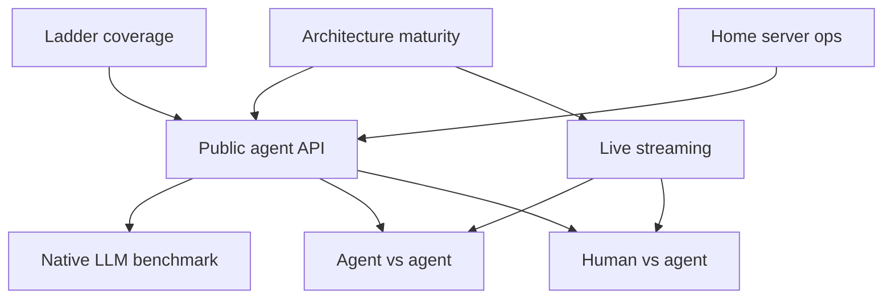

# Future work plans

| Plan | Roadmap # | Status | Estimate |
|------|-----------|--------|----------|
| [**Architecture maturity**](architecture-maturity.md) | **pre-roadmap** | planned | ~4–6 weeks |
| [Public agent API](public-agent-api.md) | #1 inbound | planned | ~2–3 weeks |
| [Native LLM benchmark](native-llm-benchmark.md) | #4 outbound client | planned | ~2 weeks (after API) |
| [Agent vs agent](agent-vs-agent.md) | #2 | planned | ~1–2 weeks |
| [Human vs agent (browser)](human-vs-agent.md) | #3 | planned | ~2 weeks |
| [Live game streaming](live-game-streaming.md) | live viewing | planned | ~3–5 days |
| [Home server ops](home-server-ops.md) | cross-cutting | planned | ~1 week |

**Prerequisite (in progress):** [Ladder coverage plan](../ladder-coverage-plan.md) — calibrated opponents 1320 → −600.

**Archived:** [Ladder improvement plan](../ladder-improvement-plan.md) · [Opponent benchmark snapshot](../opponent-benchmark.md)

---

## Dependency graph

**Do [`architecture-maturity.md`](architecture-maturity.md) first** (GameService, config split, event bus). Ladder calibration can run in parallel.
