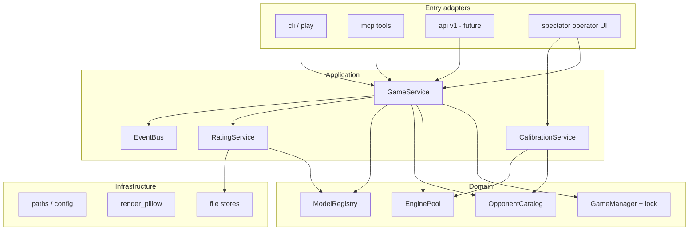
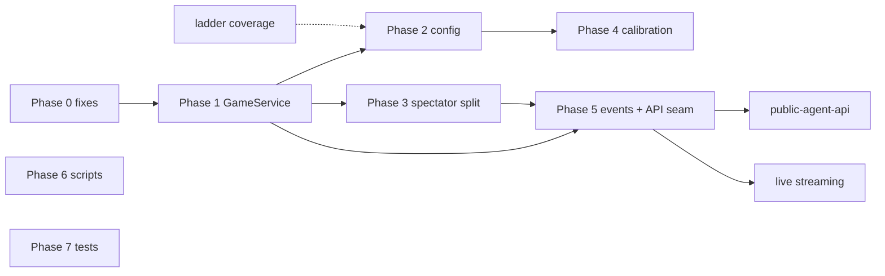

# Plan: Architecture maturity (pre-roadmap)

Status: **planned**  
Last updated: 2026-07-13  
**Blocks:** all [`plans/README.md`](README.md) roadmap items until Phase 0–2 are done  
Audience: maintainers implementing refactors before public API / streaming work

---

## Executive summary

The harness works for local agent-vs-engine play, but the codebase grew **horizontally** — three god modules, three entry points with **divergent lifecycle**, calibration logic split across packages with lazy-import cycles, and spectator HTML embedded in Python strings. Roadmap features (public HTTP API, streaming, agent-vs-agent) need **clear layers**, a **single game service**, and an **event surface** first.

This plan is **~4–6 weeks** of focused refactor (one developer), done **before** [`public-agent-api.md`](public-agent-api.md). It does not add product features; it makes them implementable without another rewrite.

---

## Current state (audit summary)

### Scale

| Area | Size | Notes |
|------|------|-------|
| `src/chess_harness/` | 27 modules, ~5.9k LOC | Flat package, no subpackages |
| `tests/` | 31 files, 146 tests | ~48 spawn real Stockfish |
| `elo_calibration/` | 12+ modules | Not in wheel; `sys.path` hacks in tests |
| `scripts/` | 16+ files | Mix of ops, one-off migrations, duplicate smoke tests |

### God modules (>400 LOC)

| Module | LOC | Mixed concerns |
|--------|-----|----------------|
| `board_controller.py` | ~839 | Game rules + PGN + render + ELO + spectator strings + audit |
| `spectator.py` | ~798 | FastAPI routes + eval engine + ~500 lines inline HTML/JS |
| `continuous_calibration.py` | ~573 | Pairing + process pool + async orchestration + persistence |
| `ladder_display.py` | ~421 | CLI formatting + web templates |

### Entry-point divergence (bug-class)

```
play.py / commands  ──► BoardController + opponent_mgr.release() after moves
tools_mcp           ──► BoardController directly (no release) → engine leaks
spectator           ──► separate GameManager, hardcoded .chess_harness path
```

| Issue | Severity | Detail |
|-------|----------|--------|
| Spectator ignores `CHESS_HARNESS_DIR` | **High** | `spectator.py` hardcodes `<project>/.chess_harness`; CLI/MCP use `resolve_base_dir()` |
| MCP skips engine cleanup | **High** | Orphan UCI processes after MCP games |
| MCP bypasses `commands` | Medium | Future API auth/middleware won't apply to MCP unless unified |
| Lazy import cycles | Medium | `agent_surface`↔`board_controller`, `calibration_view`↔`continuous_calibration`, `opponents`→`calibration_view` |

### Data / config sprawl

| Store | Location | Problem |
|-------|----------|---------|
| Opponent definitions | `opponents.json` (committed) | `enabled: false` written back to git-tracked file |
| Calibrated opponent ELO | `elo_calibration/results/merged_ratings.json` (gitignored) | Third truth layer besides catalog labels |
| Agent registry + ELO | `models.json` (gitignored) | No path to remote registration |
| Game artifacts | `.chess_harness/games/<id>/` | Correct, but spectator may read wrong root |
| Agent results | `.chess_harness/results.jsonl` | Separate from calibration `games.jsonl` |

### Duplication & dead code

- `_clean_pgn()` duplicated in `spectator.py` and `board_controller.py`
- ELO-weighted opponent pick in both `opponents.select_by_elo()` and `continuous_calibration.pick_opponent()`
- `ladder_display.split_opponent_ladder()` — no callers (legacy)
- `elo.record_game_legacy_skill()`, `results.aggregate_by_skill()` — unused
- `cli.py` — subset of `play.py`; two CLIs confuse docs
- `scripts/test_phase4/5/6.py` — manual smokes not in CI; overlap pytest

### `architecture.md` drift

Stale: Patricia/`uci_elo` emphasis, missing `continuous_calibration`, `inverse_sf`, `engine_cleanup`, `rating_math`, `calibration_view`, `ladder_display`. Does not document MCP/CLI divergence or calibration-in-spectator.

### Testing (honest assessment)

| Aspect | Verdict |
|--------|---------|
| Unit coverage of catalog, ratings math, pairing | **Good** |
| Agent surface contract | **Good** |
| MCP / spectator HTTP | **Thin** |
| `elo_calibration` runner/worker/game_loop | **Untested** in pytest |
| CI cost | **Moderate** — dual OS × ~48 engine tests; `slow` marker defined but **unused** |
| Manual `scripts/test_phase*.py` | **Redundant** with partial pytest overlap |

**Recommendation:** Tier the suite; don't expand engine integration tests until layers are stable. Deprecate manual phase scripts.

---

## Target architecture

### Layer model



### Target package layout

```
src/chess_harness/
  __init__.py
  paths.py                    # single config resolution
  config.py                   # typed settings (env + files)

  domain/
    game_manager.py           # lock, paths, I/O
    game_state.py             # state schema, validation
    opponents.py              # catalog read; enabled overrides separate file
    models.py
    engines/
      pool.py                 # OpponentEngineManager + cleanup
      stockfish.py            # adapters, harness, inverse_sf
      strength.py             # configure_opponent_strength

  services/
    game_service.py           # new/move/resign/status — sole mutation API
    rating_service.py         # agent ELO + calibration merge reads
    calibration_service.py    # continuous + batch facade
    events.py                 # in-process pub/sub for SSE later

  adapters/
    cli/                      # all play.py commands
    mcp/                      # tools_mcp, mcp_server
    api/
      agent_v1.py             # public agent-safe routes (roadmap)
      operator.py             # debug, calibration control
    spectator/
      app.py                  # FastAPI factory
      routes/
      templates/              # HTML/JS extracted from strings
      static/

  presentation/
    ladder_cli.py             # CLI leaderboard text
    agent_surface.py          # redaction — no imports from board_controller

  # Thin re-exports during migration:
  board_controller.py         # → delegates to GameService (deprecated shim)
  spectator.py                # → imports spectator.app (deprecated shim)
```

`elo_calibration/` becomes optional install extra or `chess_harness.calibration.batch` — shares `domain/engines` and `services/rating_service` only.

### Principles (enforce in code review)

1. **One mutation path** — all moves go through `GameService`; CLI/MCP/HTTP are thin adapters.
2. **Agent surface is a leaf** — `agent_surface` redacts dicts; it does not import game logic.
3. **Paths from one place** — every process calls `resolve_base_dir()`; no hardcoded `.chess_harness`.
4. **Engine pool lifecycle** — acquire in service, release in `finally` (CLI, MCP, HTTP identical).
5. **Config vs state** — committed catalog vs local overrides vs calibration results (see Phase 2).
6. **Events on mutation** — `GameService` emits after successful save (enables streaming without polling).

---

## Phases

### Phase 0 — Critical fixes (2–3 days)

**Ship immediately; no structural rename required.**

| Task | Files |
|------|-------|
| Spectator uses `resolve_base_dir()` | `spectator.py` |
| MCP `release()` after `new_game` / `make_move` (match CLI) | `tools_mcp.py` |
| Extract shared `_clean_pgn()` | new `domain/pgn_utils.py` or `services/pgn.py` |
| Document MCP/CLI parity in `architecture.md` | `architecture.md` |

**Exit:** `CHESS_HARNESS_DIR` works for spectator; MCP does not leak engines.

---

### Phase 1 — GameService extraction (1 week)

Introduce `GameService` without moving files yet (can live as `game_service.py` next to `board_controller.py`).

| Task | Detail |
|------|--------|
| `GameService` API | `new_game`, `make_move`, `resign`, `status`, `get_board_bytes`, `export_pgn` |
| Move logic out of `BoardController` | `BoardController` becomes thin wrapper or deleted after adapter migration |
| Unify MCP + CLI | Both call `GameService`; `commands.py` only parses argv |
| Inject dependencies | `GameManager`, `OpponentEngineManager`, `ModelRegistry`, `ResultsManager` |
| Add `GameEvent` dataclass | `move_applied`, `game_finished` — callback list (no SSE yet) |

**Exit:** Single code path for game mutations; `board_controller.py` shrinks by ~40%.

---

### Phase 2 — Config & state separation (3–5 days)

| Task | Detail |
|------|--------|
| Split opponent config | `opponents.json` (committed definitions) + `.chess_harness/opponents.local.json` (`enabled` overrides only) |
| Migration command | `play.py opponents migrate-local` — one-time split from current merged file |
| `RatingService` | Single read API: `ladder_elo_for_opponent()`, `agent_elo()`, `merge_calibration()` |
| Kill lazy cycles | `opponents.py` must not import `calibration_view`; rating reads go through `RatingService` |
| Align `paths.py` | `resolve_opponents_file()`, `resolve_models_file()`, `resolve_calibration_dir()` |

**Exit:** `git status` clean after normal operation; one service for all ELO reads.

---

### Phase 3 — Spectator & presentation split (1 week)

| Task | Detail |
|------|--------|
| Extract HTML/JS | `adapters/spectator/templates/` — home, game, calibration, leaderboard |
| Split routes | `routes/games.py`, `routes/calibration.py`, `routes/leaderboard.py` |
| `ladder_display.py` → `presentation/ladder_cli.py` + template partials |
| FastAPI factory | `create_app(game_service, calibration_service, settings)` — testable without globals |
| Operator vs agent routes | Prefix operator routes `/operator/`; prepares `/api/v1/` agent routes |

**Exit:** `spectator.py` <200 lines (re-export only); templates editable without parsing Python strings.

---

### Phase 4 — Calibration boundary (3–5 days)

| Task | Detail |
|------|--------|
| `CalibrationService` facade | Wraps `continuous_calibration` + reads batch results |
| Remove `sys.path.insert` | Package `elo_calibration` as `chess_harness.calibration` or `[project.optional-dependencies] calibration` |
| Dedupe pairing | One `pick_opponent_by_elo()` in `RatingService` or `domain/pairing.py` |
| Spectator lifespan | Only calls `CalibrationService.start/stop` |
| Document | Batch CLI vs continuous UI — same ratings merge, different runners |

**Exit:** No import cycles between calibration view and continuous manager; `elo_calibration` installable.

---

### Phase 5 — Event bus & API seam (3–5 days)

**Prerequisite for** [`live-game-streaming.md`](live-game-streaming.md) **and** [`public-agent-api.md`](public-agent-api.md).

| Task | Detail |
|------|--------|
| `EventBus` (asyncio) | Subscribe in spectator; publish from `GameService` after save |
| `adapters/api/agent_v1.py` | Stub routes delegating to `GameService` + `agent_surface` |
| Auth placeholder | `ApiKeyStore` reading from `models.json` or `.chess_harness/api_keys.json` |
| Rate limit placeholder | Middleware hook (no-op default) |

**Exit:** SSE prototype can subscribe to `EventBus` without touching game logic.

---

### Phase 6 — CLI & scripts cleanup (2–3 days)

| Task | Detail |
|------|--------|
| Deprecate root `play.py` | Move parser to `chess_harness.adapters.cli.main`; root shim prints deprecation once |
| Merge `cli.py` into full command set | One console script: `chess-harness` |
| Scripts taxonomy | |
| → `tools/` or keep `scripts/` | `fetch_opponents`, `verify`, `kill_engines`, `audit_ladder_gaps`, `benchmark_opponents` |
| → Archive `scripts/archive/` | `apply_ladder_coverage_catalog`, `fix_ladder_catalog`, `prune_*`, `remove_legacy_*` |
| → Delete | `test_phase4/5/6.py`, `smoke_game.py`, `test_without_engine.py`, `hard_reset.py` (use `play.py harness reset`) |
| `pyproject.toml` | Optional `[calibration]` extra with pyyaml; document in README |

**Exit:** One CLI; scripts folder is ops-only; no duplicate smoke entry points.

---

### Phase 7 — Testing strategy (ongoing, 2–3 days initial pass)

**Goal:** Faster CI, less flaky, no false confidence from redundant tests.

#### Tier definitions

| Tier | Marker | Runs | Engine |
|------|--------|------|--------|
| **Unit** | default | Every PR, both OS | None / mocked UCI |
| **Engine** | `@pytest.mark.engine` | Ubuntu CI (or both if fast enough) | Real Stockfish |
| **Nightly** | `@pytest.mark.nightly` | Scheduled only | Full games, benchmark script |

#### Actions

| Action | Detail |
|--------|--------|
| Mark ~48 engine tests | `@pytest.mark.engine` |
| CI split | `pytest -m "not engine"` on Windows; full or engine-only on Ubuntu |
| Remove duplicate manual scripts | Fold `test_phase5` spectator routes into `tests/test_spectator_api.py` (TestClient, no browser) |
| Stop adding engine E2E | New features tested via `GameService` unit tests + mocked engine |
| `elo_calibration` | Add 3–5 tests for `build_schedule` + one mocked `play_game`; skip worker pool integration |
| Coverage target | Drop pursuit of % on `spectator` templates; focus on `GameService` + `agent_surface` |
| `conftest.py` | Centralize `sys.path`, `STOCKFISH_PATH`, shared `mock_engine` fixture |

#### Deprecate / don't expand

- `test_benchmark_opponents.py` subprocess test → nightly or manual ops check
- Chasing 100% coverage on `continuous_calibration` worker loop
- New tests that spawn Stockfish for UI/HTML helpers

**Exit:** PR CI <5 min typical; engine tier documented; manual phase scripts gone.

---

### Phase 8 — Documentation sync (1–2 days)

| Task | Detail |
|------|--------|
| Rewrite `architecture.md` | Layers, GameService, config split, event bus |
| Update `docs/plans/README.md` | This plan as hard prerequisite |
| `product.md` | Remove Patricia-era success criteria (already partially done) |
| ADR-lite | `docs/adr/001-game-service.md`, `002-config-split.md` (optional, short) |

---

## Migration map → roadmap plans

| Roadmap plan | Requires architecture phase |
|--------------|----------------------------|
| [`public-agent-api.md`](public-agent-api.md) | 0, 1, 2, 5 (GameService + agent routes + auth seam) |
| [`live-game-streaming.md`](live-game-streaming.md) | 1, 3, 5 (EventBus + spectator split) |
| [`native-llm-benchmark.md`](native-llm-benchmark.md) | 1, 5 (HTTP client against same GameService) |
| [`agent-vs-agent.md`](agent-vs-agent.md) | 1, 2 (game type in GameService + state schema) |
| [`human-vs-agent.md`](human-vs-agent.md) | 1, 3, 5 (operator routes + session auth) |
| [`home-server-ops.md`](home-server-ops.md) | 0, 6 (clean deploy surface; partial before API) |
| [`ladder-coverage-plan.md`](../ladder-coverage-plan.md) | **Parallel** — catalog work can continue during Phase 0–2 |



---

## Suggested execution order

| Week | Focus |
|------|-------|
| 1 | Phase 0 + Phase 1 (GameService, MCP/CLI unify) |
| 2 | Phase 2 (config split) + start Phase 7 (mark engine tests) |
| 3 | Phase 3 (spectator templates) + Phase 4 (calibration facade) |
| 4 | Phase 5 (events + API stubs) + Phase 6 (CLI/scripts) |
| 5 | Phase 7 finish + Phase 8 docs; **then** start public-agent-api Phase 0 design |

Ladder calibration (`ladder-coverage-plan`) runs **in parallel** — it touches `opponents.json`, not package structure.

---

## Success criteria (architecture done)

- [ ] All entry points use `GameService` and `resolve_base_dir()`
- [ ] MCP and CLI pass the same engine-leak test
- [ ] `spectator.py` god file eliminated; templates on disk
- [ ] `opponents.json` no longer mutated by normal disable/enable
- [ ] No lazy import cycle between opponents ↔ calibration
- [ ] `EventBus` publishes on move; TestClient can subscribe
- [ ] CI unit tier <5 min; engine tier labeled and documented
- [ ] `architecture.md` matches repo layout
- [ ] Roadmap [`public-agent-api.md`](public-agent-api.md) Phase 1 can add routes without touching game rules

---

## Risks & mitigations

| Risk | Mitigation |
|------|------------|
| Big-bang refactor breaks agents | Keep `board_controller` shim delegating to `GameService` for one release |
| Config migration loses `enabled` flags | Migration command + backup; test on copy of `opponents.json` |
| Test churn | Phase 7 early — mark engine tests before moving modules |
| Scope creep | No agent-vs-agent or HTTP in this plan — only seams |

---

## Open decisions

1. **`play.py` at repo root** — keep forever as convenience vs pure `chess-harness`?
2. **`elo_calibration/`** — subpackage vs optional extra vs merge into `services/calibration`?
3. **Enabled opponents** — local JSON vs SQLite for future API keys too?
4. **Windows CI** — drop engine tests on Windows entirely?

---

## Estimate

| Phase | Days |
|-------|------|
| 0 Critical fixes | 2–3 |
| 1 GameService | 5–7 |
| 2 Config split | 3–5 |
| 3 Spectator split | 5–7 |
| 4 Calibration boundary | 3–5 |
| 5 Events + API seam | 3–5 |
| 6 Scripts/CLI | 2–3 |
| 7 Testing pass | 2–3 |
| 8 Docs | 1–2 |
| **Total** | **~4–6 weeks** |

Then roadmap implementation estimates from [`plans/README.md`](README.md) apply on a stable base.
