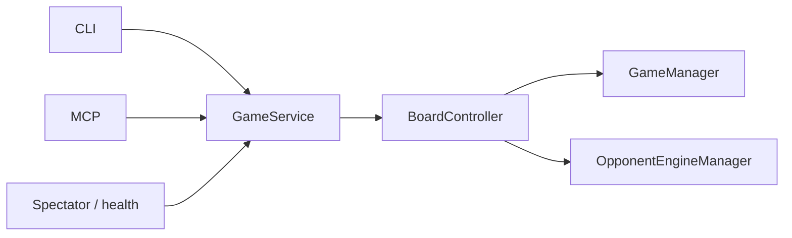

# Plan 0: Thin foundation

Status: **done**  
Last updated: 2026-07-19  
**Prerequisite:** none  
**Next plan:** [Plan 1 — Public agent API + Create Game](public-agent-api.md)

---

## Why this exists (and what it is not)

CLI, MCP, and spectator already share `BoardController`. The problem is not three forked game engines — it is **path bugs**, **engine lifecycle gaps**, and **no single mutation API** for a fourth entry point (HTTP).

This plan is a **short, mandatory precursor** to Plan 1. It is **not** a multi-week rewrite of spectator HTML, calibration imports, or the whole package layout.

**Live viewing:** Twitch screen share. No SSE/WebSocket in the product.

---

## Goal

After Plan 0:

1. All data dirs go through `resolve_base_dir()` (spectator + `ELOLadder` fixed).
2. Long-lived processes release engines and prune idle games (MCP parity with CLI).
3. A thin `GameService` wraps the existing `BoardController` / command surface so Plan 1 HTTP routes do not invent a second rules path.
4. `GET /health` exists on the serve app.
5. `game_type` exists on game state (`agent_vs_engine` default) for Plans 3–4.

Plan 0 does **not** ship Create Game, API keys, public deploy, or template extraction.

---

## Facts to build on

| Asset | Role |
|-------|------|
| `BoardController` | Single rules/ELO/PGN path today |
| `agent_surface.py` | Redaction for agents |
| `paths.py` | `resolve_base_dir()` already correct for CLI/MCP/GameManager |
| `commands.py` | CLI handlers with `release()` + idle prune — reference for MCP/HTTP |
| Spectator `/api/games/*` | Read-only; Plan 1 adds mutations under `/api/v1/` |

---

## Critical bugs (fix in this plan)

| Issue | Evidence | Why it matters |
|-------|----------|----------------|
| Spectator hardcodes `.chess_harness` | `spectator.py` ignores `CHESS_HARNESS_DIR` | Breaks deploy / custom data dir |
| `ELOLadder` default `base_dir=".chess_harness"` | `elo.py` | Wrong dir when cwd ≠ project |
| MCP no `release()` after game ops | `tools_mcp.py` vs CLI `finally` | Engine leaks on long-lived MCP |
| MCP no `check_idle_games()` | CLI/spectator have it | Stale games under MCP |
| No shared mutation facade | Plan 1 would call `BoardController` ad hoc | Fourth adapter forks habits |
| No `/health` | — | Deploy probes for Plan 1 |

---

## Target (minimal)

Plan 1 adds `/api/v1` → `GameService`. Full package split (`adapters/`, `CalibrationService`, template extraction) is **out of scope** here — do it later only when a numbered plan needs it.

### `GameService` surface (thin)

Delegate to existing controller; no rule rewrites:

- `new_game`, `make_move`, `resign`, `status`, `get_board_bytes`, `export_pgn`, `game_audit`
- Idle prune before mutations (same as CLI)
- Engine `release()` policy documented per adapter (CLI per-call; MCP after ops; spectator on shutdown)

---

## Phases

### Phase 0 — Path + lifecycle fixes (2–3 days)

- [x] Spectator `GameManager` / base dir → `resolve_base_dir()`
- [x] `ELOLadder` default → `resolve_base_dir()`
- [x] MCP: `check_idle_games()` before mutations; `opponent_mgr.release()` after game ops (match CLI)
- [x] Test: MCP engine cleanup / release parity
- [x] Deduplicate `_clean_pgn()` if cheap (optional same PR)

**Exit:** `CHESS_HARNESS_DIR` works under `serve`; MCP cleanup test green.

### Phase 1 — GameService + health (3–5 days)

- [x] Add `GameService` wrapping `BoardController` (shim OK; do not rename every call site yet)
- [x] Point CLI + MCP + spectator mutations at `GameService` where practical (tournament may stay on controller with a one-line defer note)
- [x] `get_board_bytes()` for HTTP (PNG bytes)
- [x] `game_type` on `state.json` (default `agent_vs_engine`)
- [x] `GET /health` on spectator app (200 + process up)
- [x] Short parity note in [`ARCHITECTURE.md`](../../ARCHITECTURE.md)

**Exit:** Mutations for agent play go through `GameService`; `/health` works; Plan 1 can add routes without touching rules.

---

## Plan 0 complete — checklist

Do **not** start [Plan 1](public-agent-api.md) until:

- [x] Spectator + `ELOLadder` use `resolve_base_dir()`
- [x] MCP idle prune + `release()` with a green test
- [x] `GameService` exists and is used by CLI/MCP for new/move/resign/status/board/pgn
- [x] `GET /health` returns 200
- [x] `game_type` present (default `agent_vs_engine`)
- [x] `ARCHITECTURE.md` mentions `GameService` and entry-point parity

---

## Estimate

**~1 week** one developer.

---

## Out of scope (defer — not a parallel plan)

Do these only when a later numbered plan forces them, as a phase of that plan:

| Deferred work | When |
|---------------|------|
| Extract all HTML from `spectator.py` / `ladder_display.py` | Plan 1 Create Game / Plan 4 play UI if inline HTML becomes unmanageable |
| `opponents.local.json` / `models.local.json` | When catalog `enabled` writes become a deploy pain |
| `RatingService` / `CalibrationService` facades | When ELO/calibration import cycles block a feature |
| Full `adapters/` package layout | Optional cleanup after Plan 1 ships |
| Tournament forced through `GameService` | When batch paths diverge from HTTP |
| CI split `pytest -m "not engine"` | When PR runtime hurts |

Opponent catalog / calibration rungs: [`ladder-coverage-plan.md`](../ladder-coverage-plan.md) — **not** this plan; run only between numbered plans (never at the same time).

---

## Out of scope (other roadmap)

- Create Game, API keys, TLS, rate limits → **Plan 1**
- LLM providers → **Plan 2**
- Agent vs agent / human vs agent → **Plans 3–4**
- SSE / WebSocket → **not planned**
