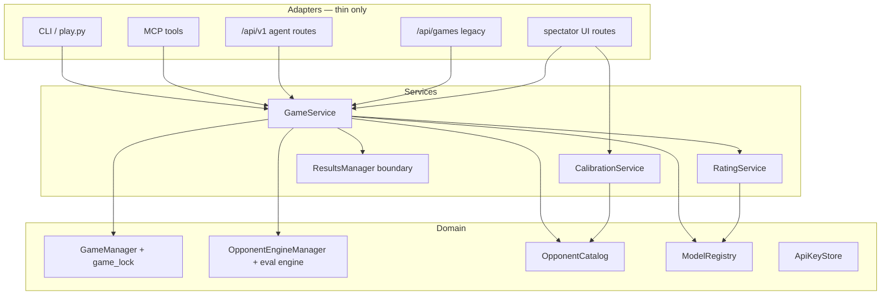

# Plan 0: Architecture foundation

Status: **not started**  
Last updated: 2026-07-14  
**Prerequisite:** none — **do this before any other roadmap plan**  
**Next plan:** [Plan 1 — Public agent API + Create Game](public-agent-api.md)

---

## Why this exists

The harness works today for local agent-vs-engine play, but the codebase will not survive the roadmap unchanged:

- **Plan 1** adds HTTP + Create Game + public deploy → fourth entry point beside CLI, MCP, spectator
- **Plans 2–4** add new game types and clients on the same surface

Without this plan, each roadmap item forks `board_controller.py`, `spectator.py`, and `ladder_display.py`. **Now or never** — foundation once, then roadmap plans only add features.

**Live viewing:** Twitch screen share. No SSE/WebSocket in the product.

**Existing code to build on (not greenfield):**

- `agent_surface.py` — redaction already works
- `paths.py` — `resolve_base_dir()`, `resolve_opponents_file()`, `resolve_models_file()` exist
- `commands.py` — shared handlers for `play.py` (CLI parity reference for MCP)
- `/api/games/*` — spectator already has redacted game routes; Plan 0 documents migration to `/api/v1/*`

---

## What each roadmap plan needs from Plan 0

| Roadmap plan | Must have from Plan 0 |
|--------------|----------------------|
| **Plan 1** — Public API + Create Game | `GameService`; MCP/CLI/spectator engine parity; `Settings` (public URL, limits); `/api/v1/` routes + `GET /health`; auth/rate-limit/concurrency hooks; `ApiKeyStore` tied to model registry; templates + `create_game.html`; legacy `/api/games` deprecation strategy |
| **Plan 2** — Native LLM benchmark | HTTP client targets same `/api/v1` surface |
| **Plan 3** — Agent vs agent | `game_type` in state; multi-principal `make_move` auth (two API keys, one game); dual-sided ELO + audit via `RatingService` |
| **Plan 4** — Human vs agent | Session hook on operator routes; `RatingService` excludes human games from agent ladder; `play.html` template stub |

Plan 0 delivers **seams and layers**, not product features.

---

## Current problems (verified audit)

| Issue | Evidence | Blocks |
|-------|----------|--------|
| `board_controller.py` **839 LOC** — rules, PGN, ELO, audit, spectator strings | `src/chess_harness/board_controller.py` | Thin HTTP/MCP adapters |
| `spectator.py` **798 LOC** — inline HTML + routes | `src/chess_harness/spectator.py` | Create Game tab |
| `ladder_display.py` **421 LOC** — leaderboard/calibration HTML/CSS/JS | `src/chess_harness/ladder_display.py` | Template extraction (not only spectator.py) |
| MCP no `release()` after games | CLI: `commands.py` `finally: release()`; MCP: `tools_mcp.py` singleton, no release | Engine leaks on public server |
| MCP no `check_idle_games()` before mutations | CLI: `commands.py`; spectator polls it; MCP skips | Stale games, resource use |
| Spectator hardcodes `.chess_harness` | `spectator.py` `_base = project_root / ".chess_harness"` | `CHESS_HARNESS_DIR` / deploy |
| Three controller lifecycles | CLI per-call + release; MCP singleton; spectator singleton + shutdown release | Inconsistent behavior |
| `opponents.json` mutated for `enabled` | `OpponentCatalog.set_enabled()` writes catalog file | Dirty git on deploy |
| `models.json` mutated for `enabled` | `ModelRegistry.set_enabled()` same pattern | Same |
| `ELOLadder` default `base_dir=".chess_harness"` | `elo.py` | Wrong dir when env set |
| Calibration coupling | Lazy imports `opponents`↔`calibration_view`↔`continuous_calibration`; `sys.path` hack in continuous_calibration | Import/deploy fragility |
| `_clean_pgn()` duplicated | `board_controller.py` + `spectator.py` | Drift |
| No `GameService`, no `/api/v1/` | — | Plan 1 would fork logic |
| No engine-leak test for MCP | `test_mcp.py` teardown only | Can't gate Plan 1 |
| `TournamentManager` calls `BoardController` directly | bypasses unified path | Plan 2+ batch paths diverge |

---

## Target architecture



### Principles

1. **One mutation path** — all moves through `GameService` (including tournament batch if not explicitly deferred).
2. **Agent surface is a leaf** — `agent_surface` redacts; no game logic imports.
3. **Paths from one place** — `resolve_base_dir()` everywhere; fix `ELOLadder` default.
4. **Two engine lifecycles** — opponent pool (`OpponentEngineManager`) vs spectator eval engine; both documented; acquire/release in `finally`.
5. **Config vs state** — committed catalog + `.chess_harness/*.local.json` overrides; calibration results read-only.
6. **Templates on disk** — extract from `spectator.py` **and** `ladder_display.py`.
7. **One FastAPI factory** — `create_app(game_service, calibration_service, settings)`; web UI + `/api/v1` + middleware share it.

### Target layout

```
src/chess_harness/
  paths.py                    # exists; extend as needed
  config.py                   # Settings: base_dir, public_url, limits (stubs OK)
  domain/
    game_manager.py           # exists
    opponents.py, models.py   # exists; stop writing enabled to committed files
    engines/                  # OpponentEngineManager, stockfish, inverse_sf (split from engine.py)
  services/
    game_service.py           # new/move/resign/status/get_board_bytes/export_pgn/audit
    rating_service.py
    calibration_service.py
    pgn.py                    # shared _clean_pgn
  adapters/
    cli/                      # commands.py → thin argv parsing
    mcp/                      # tools_mcp → GameService; release + idle parity
    api/
      agent_v1.py             # /api/v1/* stubs
      legacy_games.py         # /api/games/* → GameService (deprecate in Plan 1)
    spectator/
      app.py, routes/, templates/
        create_game.html      # stub for Plan 1
        play.html             # stub for Plan 4
  presentation/
    agent_surface.py, ladder_cli.py
  board_controller.py         # shim → GameService (then remove)
  spectator.py                # shim → adapters.spectator.app
  ladder_display.py           # shim or presentation helpers only (no inline HTML)
```

`state.json` schema: add **`game_type`** field (`agent_vs_engine` default). Full typed `game_state.py` module is optional — don't block Plan 0 on it.

---

## Phases

### Phase 0 — Critical fixes (2–3 days)

| Task | Files |
|------|-------|
| Spectator uses `resolve_base_dir()` for `GameManager` | `spectator.py` |
| MCP `opponent_mgr.release()` after `new_game` / `make_move` (match CLI `finally`) | `tools_mcp.py` |
| MCP `check_idle_games()` before mutations (match `commands.py`) | `tools_mcp.py` |
| `ELOLadder` default base dir → `resolve_base_dir()` | `elo.py` |
| Extract shared `_clean_pgn()` | `services/pgn.py` |
| **Add test:** MCP release parity (`test_mcp_engine_cleanup.py` or extend `test_mcp.py`) | `tests/` |
| Document entry-point parity table | `architecture.md` |

**Parity table to document:**

| Behavior | CLI | MCP | Spectator |
|----------|-----|-----|-----------|
| `release()` after game ops | per-call | **fix** | shutdown only (OK) |
| `check_idle_games()` | yes | **fix** | yes (poll) |
| `resolve_base_dir()` | yes | yes | **fix** |
| Mutation entry | commands → BC | singleton BC | singleton BC |

**Exit:** MCP leak test green; spectator respects `CHESS_HARNESS_DIR`.

---

### Phase 1 — GameService (1 week)

| Task | Detail |
|------|--------|
| `GameService` API | `new_game`, `make_move`, `resign`, `status`, `get_board_bytes`, `export_pgn`, `game_audit` |
| Move logic out of `BoardController` | Shim delegates; tournament uses `GameService` or explicit defer note in checklist |
| Unify CLI + MCP + spectator controller | All call `GameService`; inject `GameManager`, `OpponentEngineManager`, registries |
| `game_type` in `state.json` | Default `agent_vs_engine` |
| `GameBusyError` → HTTP mapping helper | Plan 1 returns 503 + retry semantics |
| Preserve `move_audit` trail | Same files under `.chess_harness/games/` |
| Concurrency hooks (no-op defaults) | `max_concurrent_games`, active engine count — Plan 1 enforces values |
| `get_board_bytes()` | PNG bytes for HTTP (today file-path based) |

**Exit:** All mutations go through `GameService`; adapters contain no game rules.

---

### Phase 2 — Config & ratings (3–5 days)

| Task | Detail |
|------|--------|
| `opponents.local.json` | `enabled` overrides only; migrate from `opponents.json` |
| `models.local.json` | same for `ModelRegistry.set_enabled()` |
| Migration commands | `play.py opponents migrate-local`, `play.py models migrate-local` |
| `RatingService` | `ladder_elo_for_opponent()`, `agent_elo()`, merge calibration; hook for **human-game exclusion** (Plan 4, no-op until then) |
| Kill lazy cycles | `opponents.py` must not import `calibration_view`; reads via `RatingService` |
| Note | `resolve_opponents_file()` / `resolve_models_file()` already in `paths.py` |

**Exit:** `git status` clean after enable/disable; one ELO read API.

---

### Phase 3 — Spectator + API app (1–1.5 weeks)

Merge old Phases 3 + 5 — one FastAPI refactor.

| Task | Detail |
|------|--------|
| Extract templates | From `spectator.py` **and** `ladder_display.py` → `adapters/spectator/templates/` |
| Stubs | `create_game.html`, `play.html` (empty); wire `create_game` into nav (`spectator_tabs()`) |
| Split routes | `routes/web.py`, `routes/calibration.py`, `routes/legacy_api.py`, `routes/agent_v1.py` |
| `create_app(...)` factory | Injects `GameService`, `CalibrationService`, `Settings` |
| Route map | See table below |
| `/api/v1/` stubs | `GameService` + `agent_surface`; mirror Plan 1 endpoint list |
| `GET /health` stub | 200 + process up (Plan 1 deploy) |
| Middleware hooks | Auth (`ApiKeyStore` → model registry), rate limit, CORS (off), session (operator, off) |
| Legacy `/api/games/*` | Rewire to `GameService`; same redaction; document deprecation for Plan 1 |
| Tests | Extend `test_agent_surface.py` TestClient coverage + `/api/v1` stubs |

**Route map (target):**

| Path | Role |
|------|------|
| `/`, `/calibration`, `/leaderboard`, `/g/{id}` | Spectator web UI |
| `/api/calibration/*` | Operator calibration API (session hook Plan 4) |
| `/api/games/*` | Legacy spectator API → `GameService` (deprecate in Plan 1) |
| `/api/v1/*` | Agent API stubs (Plan 1 implements) |
| `/health` | Deploy probe |

**Exit:** No large HTML strings in Python; shims `spectator.py` + `ladder_display.py` thin; TestClient green on agent-safe routes.

---

### Phase 4 — Calibration boundary (3–5 days)

| Task | Detail |
|------|--------|
| `CalibrationService` facade | Wraps `continuous_calibration` + batch result reads |
| Dedupe pairing logic | Shared helper for `OpponentCatalog.select_by_elo()` vs `continuous_calibration.pick_opponent()` weighting — not one renamed function |
| Spectator lifespan | Only `CalibrationService.start/stop` |
| **Remove `sys.path` hack** | `continuous_calibration.py` → proper package import or `[calibration]` extra |

**Exit:** No import cycles; spectator does not import `continuous_calibration` directly.

---

### Phase 5 — CLI & scripts cleanup (1–2 days)

| Task | Detail |
|------|--------|
| Deprecate duplicate CLI | `play.py` is canonical; audit `cli.py` flag gaps; document or merge missing commands |
| Archive one-off scripts | `scripts/archive/` — ladder migration scripts |
| Remove manual smokes | `scripts/test_phase4.py`, `test_phase5.py`, `test_phase6.py` → pytest |
| `deploy/README.md` | Placeholder for Plan 1 Phase 2 |

**Exit:** One documented CLI entry; ops scripts separated.

---

### Phase 6 — Testing (2–3 days, start Week 1)

| Task | Detail |
|------|--------|
| Add `@pytest.mark.engine` to `pyproject.toml` | Mark ~40–45 Stockfish-spawning tests (count in CI setup) |
| CI split | `pytest -m "not engine"` on PR; engine tier documented |
| `GameService` unit tests | Mocked engine |
| MCP engine cleanup test | **Gate** — from Phase 0 |
| Expand `conftest.py` | `tmp_harness_dir`, `mock_engine`, `resolve_base_dir` fixtures |
| Extend `test_agent_surface.py` | `/api/v1` stubs + legacy `/api/games` parity |

**Exit:** PR unit tier <5 min; engine tier labeled.

---

### Phase 7 — Docs sync (1 day)

| Task | Detail |
|------|--------|
| Rewrite `architecture.md` | Layers, GameService, route map, entry-point parity |
| Update [`roadmap/README.md`](README.md) | Mark Plan 0 complete when checklist met |
| Fix [Plan 1](public-agent-api.md) | Says `GameService`, not `BoardController` |

---

## Plan 0 complete — checklist

Do **not** start [Plan 1](public-agent-api.md) until all are true:

- [ ] CLI, MCP, spectator mutations go through `GameService`
- [ ] `test_mcp_engine_cleanup` (or equivalent) — MCP `release()` after game ops
- [ ] MCP calls `check_idle_games()` before mutations
- [ ] Spectator uses `resolve_base_dir()`; `ELOLadder` uses it too
- [ ] Templates on disk (`create_game.html`, `play.html` stubs); no bulk HTML in `spectator.py` / `ladder_display.py`
- [ ] `create_app()` factory with `Settings` (public URL, limit fields — defaults OK)
- [ ] `/api/v1/` stubs + `GET /health` → `GameService` + `agent_surface` (TestClient green)
- [ ] Legacy `/api/games/*` rewired to `GameService` (deprecation documented for Plan 1)
- [ ] Auth + rate-limit + concurrency hooks on `GameService`/middleware (no-op OK)
- [ ] `opponents.local.json` + `models.local.json`; committed catalog files stable in git
- [ ] `RatingService` sole ELO read path; no opponents ↔ calibration import cycle
- [ ] `sys.path` hack removed from continuous calibration path
- [ ] `architecture.md` matches layout
- [ ] PR CI unit tier <5 min

---

## Execution order

| Week | Focus |
|------|-------|
| 1 | Phase 0 fixes + Phase 6 start (pytest markers, conftest, MCP leak test) |
| 2 | Phase 1 GameService + adapter delegation |
| 3 | Phase 2 config splits + RatingService |
| 4 | Phase 3 spectator/API app (templates, `/api/v1`, `/health`, middleware) |
| 5 | Phase 4 calibration facade |
| 6 | Phase 5 scripts + Phase 6 finish + Phase 7 docs → **start Plan 1** |

[`ladder-coverage-plan.md`](../ladder-coverage-plan.md) — catalog only; can run during Plan 0.

---

## Estimate

**~5–6 weeks** one developer (merged spectator/API refactor; tests from Week 1). Then Plan 1 (~3–4 weeks).

---

## Out of scope

- Create Game product UI, deploy TLS, agent registration flows → **Plan 1**
- LLM providers → **Plan 2**
- Agent vs agent / human vs agent rules → **Plans 3–4**
- SSE / WebSocket → **not planned**
- New opponent rungs → **ladder-coverage-plan.md**
