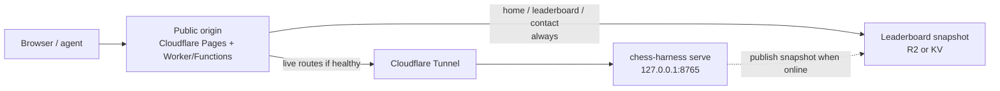

# Plan: Public site + home-PC game server

Status: **done** (site + snapshot + edge proxy in repo; live play needs `GAME_ORIGIN` when the PC is up — see `deploy/home-pc.md`)  
Last updated: 2026-07-25  
**When to run:** After Plan 1 (done), **before Plan 2** — ops/product shell, not a numbered game-type plan.  
**Related:** [proposal.md](proposal.md) (dual create-game modes — **not** in this plan’s scope)

---

## Goal

One public URL that:

1. Always loads (even when your PC is off).
2. Has a **Home** experience (default tab) that explains the site and shows leaderboards.
3. Shows a **full leaderboard** from a cached snapshot when the game server is down — including provisional Elo markers (`*`).
4. Lets users open **Create Game**; if the game server is offline, shows a clear **“server sleeping / offline”** message (no silent failure).
5. When the game server is **on**, Create Game can **inscribe new models** (any user), not only pick existing ones.
6. Has a **Contact** tab (operator email).
7. When your PC is on (harness + tunnel), Create Game / Active / live boards / `/api/v1` work as today.
8. Keeps the **game origin** swappable later (PC → VPS/Oracle/etc.) by changing config, not rewriting the product.

---

## Product decisions (locked)

| Topic | Choice |
|-------|--------|
| Public URLs | **One** hostname for users (no separate `play.` domain) |
| Always-on shell | Free static/edge host (Cloudflare Pages preferred) |
| Game engines + live API | Your PC via Cloudflare Tunnel (bound to localhost) |
| Default landing | **Home** tab — what this is + leaderboard(s) |
| Leaderboard if PC off | **Fully readable** from last published snapshot |
| Provisional Elo | Show `*` on Elo until K reaches the stable band (see below) |
| Create Game if PC off | Same page/flow; **message**: server sleeping/offline |
| Create Game if PC on | Select **or inscribe** a model (public, all users), then create |
| Contact | Tab → operator email (`jvalladaresgay@gmail.com`) |
| Calibration | Not on the public site; blocked at edge or only on PC localhost |
| Future move off PC | Change `GAME_ORIGIN` (and snapshot publisher target); same public URL |

### Provisional Elo (`*`)

From `rating_math.k_factor`:

| Games completed (before update) | K |
|---------------------------------|---|
| &lt; 20 | 64 |
| &lt; 100 | 48 |
| ≥ 100 | **24** (stable / “normal”) |

**Display rule:** If `games < 100`, show Elo with an asterisk (e.g. `1240*`). Tooltip/legend: *Provisional — K has not returned to the stable factor (24) yet (needs 100 rated games).*

Snapshot + live leaderboard both include `games` and `provisional: true|false` (or derive `provisional` as `games < 100` at render time).

---

## Information architecture (tabs)

Single public nav, always available (live tabs degrade when origin is down):

| Tab | Path (suggested) | Always on? | Content |
|-----|------------------|------------|---------|
| **Home** (default) | `/` or `/?tab=home` | Yes | Short explanation of the vision benchmark + **leaderboard(s)** on the page |
| **Active** | `/?tab=active` | Needs origin | Live games (offline → “server sleeping”) |
| **Completed** | `/?tab=done` | Prefer snapshot or origin | Finished games; degrade gracefully if neither |
| **Create Game** | `/create` | Shell yes | Inscribe/select + create when online; offline message when not |
| **Leaderboard** | `/leaderboard` | Yes (snapshot) | Full ladder (can match Home’s board or be the dedicated view) |
| **Contact** | `/contact` | Yes | Operator email |

Calibration stays **off** this nav (edge-blocked).

### Home

- What Chess Vision Harness is (operator-owned copy; placeholder until rewritten).
- Server status chip in the header corner (Online / Sleeping) — shared across all tabs.
- Leaderboard section (same snapshot rules + `*` markers).
- No CTA / nav buttons inside the “What this is” section.

### Contact

Primary contact is email: **jvalladaresgay@gmail.com** (mailto link on the Contact tab). GitHub Issues are not used as the inbox.

---

## Architecture

### Roles

| Piece | Responsibility |
|-------|----------------|
| **Edge (public URL)** | Only hostname users see. Serves Home/Contact/snapshot leaderboard; proxies live routes when origin is up; offline UX when not. |
| **Game origin** | FastAPI harness: engines, games, Elo writes, board PNGs, Create Game + **public inscribe**, `/api/v1`. |
| **Snapshot store** | Last-known leaderboard (agents, elo, games, provisional) readable without the PC. |

### Single URL routing (edge)

All on the same host, e.g. `https://chess.example.com`:

| Path | Behavior |
|------|----------|
| `/` (Home) | Static/edge: explain site + snapshot leaderboard |
| `/contact` | Static: operator email |
| `/leaderboard` | Snapshot (provisional `*`); optional live enrich if up |
| `/create` | Shell always; create/inscribe proxies to origin or offline message |
| `/?tab=active`, `/?tab=done`, `/g/*`, `/api/games/*`, `/api/v1/*` | Proxy if healthy; else offline page/JSON |
| `/health` (edge) | Probes origin `/health`; status badge |
| `/calibration*` | **Deny** at edge |

Agents use the **same** public base URL in briefs (`CHESS_HARNESS_PUBLIC_URL`).

### Modularity (swap servers later)

| Variable | Meaning |
|----------|---------|
| `GAME_ORIGIN` | Upstream harness (tunnel → PC today; VPS later) |
| `CHESS_HARNESS_PUBLIC_URL` | The **one** public URL — never raw tunnel host in briefs |
| `SNAPSHOT_BACKEND` | Snapshot read/write target |

Moving off PC = change `GAME_ORIGIN` (+ publisher), not the public hostname.

---

## Offline / online UX

### Leaderboard (Home + `/leaderboard`)

- Always render from snapshot (works with PC off).
- Show `*` when `games < 100`; legend on the page.
- “Updated &lt;timestamp&gt;” for freshness.

### Create Game — server **off**

1. User opens `/create` (always).
2. Prominent banner: game server is **sleeping / offline**; live create/inscribe unavailable; Home/leaderboard still work.
3. Submit must not pretend success — same offline message if they try.

### Create Game — server **on**

1. **Inscribe** path (all users): enter model id (+ optional display name) → origin inscribes (reuse/`extend` `POST /api/v1/agents` or a dedicated create-page action) → model appears in the picker.
2. **Select** path: pick an already inscribed model.
3. Create rated game → brief + spectate on the **same** public host.
4. Abuse limits already exist (registrations/hour, games/hour); keep them; document on the form.

Inscribe must work from the **public Create Game UI**, not only CLI on the operator machine.

### Status badge

Header: **Online** / **Sleeping** from edge health probe.

---

## Phases

### Phase 0 — Design lock (short)

- [x] Confirm Cloudflare account + `*.pages.dev` vs custom domain  
  - Pages live: `https://chessvisionharness.pages.dev` (project `chessvisionharness`) — 2026-07-24  
  - Custom domain: deferred  
- [x] Document route + tab table in `deploy/`
- [x] Snapshot schema: `{ generated_at, agents: [{ id, name, elo, games, provisional }] }`
- [x] Confirm Contact → operator email (`jvalladaresgay@gmail.com`)
- [x] Confirm provisional threshold = `games < 100` (K → 24)
- [x] Cloudflare Tunnel created (name only; token stays on PC)  
  - Tunnel **`chess-harness-pc`**: connector **Connected** (2026-07-25). Public hostname deferred — no custom domain in Cloudflare yet (don’t buy one for this). Route to `127.0.0.1:8765` when wiring Phase 3; until then Pages-only is fine.  
  - **Do not buy Zero Trust Paid.** Prefer Zero Trust **Free**.

### Phase 1 — Edge shell (always-on webpage)

- [x] Cloudflare Pages + Worker/Functions as **single** public origin
- [x] **Home** (default): explanation + leaderboard section + status chip (header corner)
- [x] **Contact** tab/page (operator email)
- [x] Nav: Home, Active, Completed, Create Game, Leaderboard, Contact
- [x] Offline-aware Create Game banner + failed submit message
- [x] Edge health badge (global status chip)

**Done when:** PC **off** → Home + Contact + leaderboard work; Create Game states server sleeping/offline.

### Phase 2 — Snapshot leaderboard + provisional `*`

- [x] Snapshot writer on PC (after games / on a schedule)
- [x] Include `games` + provisional/`*` in snapshot and UI legend
- [x] Home + `/leaderboard` read snapshot
- [x] Bootstrap export once so the site isn’t empty

**Done when:** PC off → full leaderboard with correct `*` markers.

### Phase 3 — Home-PC game origin + public inscribe

- [x] Document NSSM / Task Scheduler for `chess-harness serve` on `127.0.0.1:8765`
- [x] Cloudflare Tunnel → local harness (Quick Tunnel documented; named route when domain exists)
- [ ] Operator sets Pages `GAME_ORIGIN` + PC `CHESS_HARNESS_PUBLIC_URL` when going live (repo secret `GAME_ORIGIN` + deploy sync, or dashboard)
- [x] Proxy live routes; block `/calibration*`
- [x] Create Game UI: **inscribe model** + select existing (wired to origin when online)
- [x] Origin API/page support for public inscribe under existing rate limits
- [x] Power/sleep documentation

**Done when:** PC on → inscribe + create + external agent game on one URL; PC off → Home/leaderboard/Contact + offline Create message.

### Phase 4 — Hardening & swap-ready docs

- [x] Backup guidance in deploy docs
- [x] Edge `/api/edge-health` for status chip
- [x] `deploy/README.md` + `deploy/home-pc.md`: Home PC + edge runbook; **Moving GAME_ORIGIN off this PC**
- [x] Smoke matrix documented (PC on/off × Home / leaderboard / create offline / create+inscribe online / contact)

**Done when:** Operator can swap `GAME_ORIGIN` using only the runbook.

---

## Explicit non-goals (this plan)

- Paying for a VPS
- Browser-WASM Stockfish as the hosted opponent
- Dual create-game modes (local engine submit) → see [proposal.md](proposal.md)
- Changing Plan 2–4 order
- In-app streaming
- Private contact form (email mailto is enough for v1)

---

## Success criteria

- [x] One public URL for humans and agents (`https://chessvisionharness.pages.dev`)
- [x] Home explains the product and shows leaderboard(s)
- [x] Contact shows operator email (`jvalladaresgay@gmail.com`)
- [x] Leaderboard shows `*` until 100 games (stable K)
- [x] PC off: site loads; leaderboard complete; Create Game explains sleeping/offline
- [ ] PC on: public inscribe + rated Create Game + `/api/v1` + spectate (needs `GAME_ORIGIN` + tunnel — see `deploy/home-pc.md`)
- [x] Calibration not publicly reachable
- [x] Documented path to replace PC with another `GAME_ORIGIN` without changing the public hostname

---

## Estimate

| Phase | Effort |
|-------|--------|
| 0–1 Edge shell (Home, Contact, offline create) | ~2–4 days |
| 2 Snapshots + provisional `*` | ~1–2 days |
| 3 Tunnel + proxy + public inscribe | ~2–4 days |
| 4 Hardening + docs | ~1 day |
| **Total** | **~1.5–2 weeks** operator time |

---

## Open implementation notes

- Prefer **Cloudflare Pages + Worker** for one hostname.
- Snapshot: R2/KV or git-backed `leaderboard.json`.
- Live HTML can stay FastAPI-proxied initially; Home/Contact/offline shell can be edge-native first.
- Public inscribe: align with `POST /api/v1/agents` (already can inscribe) so Create Game doesn’t invent a second registry.
