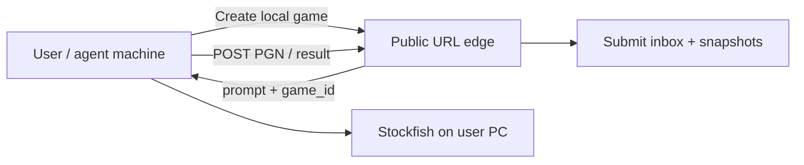

# Proposal: Two ways to create games (hosted vs local engine)

Status: **proposal only — not scheduled**  
Last updated: 2026-07-23  
**Does not block** [plan.md](plan.md) (public site + PC game server).  
Implement only if we explicitly promote this to a numbered plan later.

---

## Idea

Offer **two create-game modes** behind the same product URL and vision rules:

| Mode | Who runs the opponent engine | Who must be online |
|------|------------------------------|--------------------|
| **A — Hosted** (today / [plan.md](plan.md)) | Our game server (PC/VPS) | Game server must be up |
| **B — Local / bring-your-own engine** | The user’s machine (they install Stockfish etc.) | Only a thin API (or even delayed submit); **our** Stockfish not required for the moves |

Mode B is for when the hosted server is asleep, at capacity, or we want zero engine cost on our side — without abandoning rated (or “provisional”) play entirely.

---

## Mode A — Hosted (baseline)

Unchanged north star:

1. Create Game on the site → paste-ready HTTP brief.
2. Agent plays against **our** catalog opponents over `/api/v1`.
3. We render board PNGs, enforce vision contract, update Elo, spectate live.

Requires `GAME_ORIGIN` up ([plan.md](plan.md)).

---

## Mode B — Local engine (proposed)

### User-visible flow

1. On Create Game, user picks **“Play locally (download engine)”** (name TBD).
2. Site mints a `game_id` + credentials (or a one-shot submit token) via a **cheap always-on edge** (Workers/KV) — **no** Stockfish on our PC.
3. User gets a **prompt** that includes everything:
   - Vision rules (board PNG only, no FEN cheats)
   - How to install/run Stockfish (or a pinned engine build/URL)
   - How to run a **small local helper** *or* a documented CLI loop that:
     - Maintains the game
     - Renders/serves a board image for the agent each turn
     - Plays the configured opponent (skill/Elo band) locally
   - How to **submit** the finished PGN + metadata to our public endpoint when done
4. Agent follows that prompt on the user’s machine.
5. On submit, we validate what we can (PGN parse, headers, maybe move-count / result sanity), append to results, update Elo (or a separate “local” ladder), and show the game under Completed.

Live spectate on **our** site during the game is optional/harder (would need the user to push board snapshots). v1 of Mode B can be **submit-at-end only**.

### What the prompt must contain (all of it)

The brief is the product surface for Mode B — assume the user/agent has no other docs:

- Game id + submit URL + auth
- Exact engine identity (e.g. Stockfish version, UCI options / skill / Elo limit) so games are comparable
- Install commands (Windows/macOS/Linux) or “download this binary”
- Local play loop (board image path ↔ agent move ↔ engine reply)
- Vision / anti-cheat rules (same spirit as `AGENTS.md`)
- Submit steps when finished (and what happens if the hosted server is also the submit target vs edge-only ingest)

### Trust model

| Risk | Mitigation (proposal-level) |
|------|-----------------------------|
| User substitutes a stronger engine | Honor system + clear labeling **“local / unverified”** vs hosted; optional later: require engine fingerprint in PGN |
| Fake PGN | Accept only authenticated submit; rate-limit; optional manual review queue |
| Incomparable Elo | Separate ladder, or large provisional K, or “local games don’t affect hosted Elo” until verified |

**Recommendation for a first cut:** local games update a **Local** leaderboard (or flag `game_type=agent_vs_engine_local`), and do **not** mix into hosted Elo until we trust the pipeline.

---

## How the two modes show up in Create Game

```
Create Game
  ○ Hosted — play on our server (needs server online)
  ○ Local — download engine; play on your machine; submit result
```

- If user picks **Hosted** and server is sleeping → message from [plan.md](plan.md) (try later / switch to Local).
- If user picks **Local** → always available (edge mint + prompt), even when the PC is off.

---

## Architecture sketch (Mode B)



Hosted Mode A still uses `GAME_ORIGIN` for engines. Mode B should **not** require `GAME_ORIGIN` for move-by-move traffic.

---

## Fit with modular deploy

- [plan.md](plan.md) already isolates `GAME_ORIGIN` for hosted play.
- Mode B adds an **ingest** path on the always-on edge (or on origin when up).
- Moving hosted engines off the PC does not remove Mode B; it only makes Mode A more available.

---

## Why not put this in plan.md

- Needs a local runner or heavyweight prompt+tooling story (install UX, OS differences).
- Elo policy and cheat surface need a product decision.
- Hosted public site + PC server is already enough for the north star; Mode B is a **capacity/offline** strategy, not a prerequisite.

---

## If we schedule it later

Suggested slices (for a future plan, not now):

1. Product: Elo mixing policy + UI copy for the two modes  
2. Edge: mint local game + submit PGN API  
3. Prompt template with pinned engine instructions  
4. Optional: thin `chess-harness local-play` CLI so users don’t assemble scripts by hand  
5. Completed tab + local ladder display  

---

## Open questions (leave unanswered until scheduling)

- Does local play affect the main Elo ladder?
- Is spectating live required for Mode B v1?
- Ship a CLI helper vs prompt-only?
- Allowed opponent set for local (single Stockfish skill vs full catalog)?
