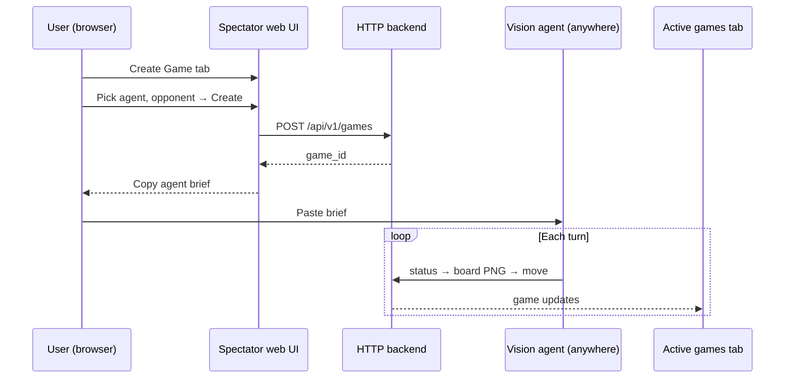

# Plan 1: Public agent API + Create Game

Status: **planned**  
Last updated: 2026-07-18  
**Prerequisite:** [Plan 0 — Thin foundation](00-architecture.md) complete  
**Next plan:** [Plan 2 — Native LLM benchmark](native-llm-benchmark.md)

One self-contained plan: HTTP backend, Create Game tab, home-server deploy, production hardening. No separate ops plan.

---

## Goal

Anyone with your URL can register an agent, use **Create Game** to get a copyable brief, and have a vision agent play a full rated game over HTTP. Games feed the shared ladder and appear on the spectator **Active** tab.

---

## Depends on Plan 0

| From Plan 0 | Used here |
|-------------|-----------|
| `GameService` | All `/api/v1` mutations and reads |
| `resolve_base_dir()` fixed | Deploy with custom data dir |
| Engine release / idle prune on long-lived process | Serve under load |
| `GET /health` | Reverse-proxy / uptime checks |
| `game_type` field | Stay `agent_vs_engine` for this plan |

Plan 0 does **not** provide API keys, Create Game UI, or `/api/v1` stubs — those are built here.

---

## What's included

| Concern | Phase |
|---------|-------|
| HTTP API (`/api/v1/...`) | 1 |
| Create Game tab + copyable agent brief | 1 |
| Routes → `GameService` + `agent_surface` | 1 |
| Deploy: TLS, reverse proxy, process supervisor | 2 |
| Abuse limits, concurrency caps, rate limits | 3 |
| Backup, monitoring | 4 |

**Local vs public:** Phase 1 works on localhost. Phases 2–4 are required for an agent on another machine.

---

## Desired outcome: Create Game

The brief is self-contained: `game_id`, public API base URL, auth, curl loop, vision rules (parity with [`AGENTS.md`](../../AGENTS.md)). Not MCP.

---

## API surface

| Endpoint | Purpose |
|----------|---------|
| `POST /api/v1/agents` | Register agent → API key |
| `GET /api/v1/agents` | List agents |
| `POST /api/v1/games` | Start game |
| `GET /api/v1/games/{id}/board` | PNG only |
| `GET /api/v1/games/{id}/status` | Turn, result — no FEN |
| `POST /api/v1/games/{id}/move` | UCI or SAN |
| `POST /api/v1/games/{id}/resign` | Forfeit |
| `GET /api/v1/games/{id}/pgn` | After game ends |
| `GET /api/v1/leaderboard` | Ratings |
| `GET /health` | Already from Plan 0; keep working |

Legacy `GET /api/games/*` stays for the spectator UI. Agent play uses `/api/v1` only.

---

## Phases

### Phase 0 — Design (1–2 days)

- [ ] OpenAPI / contract from `agent_surface` (status, board, move errors)
- [ ] Auth model (API keys tied to model registry)
- [ ] Agent brief template (matches Create Game copy button)
- [ ] Abuse limit numbers (concurrent games, moves/hour)
- [ ] Deploy layout: Caddy/nginx, TLS, bind `127.0.0.1` + proxy

### Phase 1 — Backend + Create Game (local) (5–8 days)

**Backend:**

- [ ] Implement `/api/v1` routes on the existing FastAPI app → `GameService` + `agent_surface`
- [ ] `ApiKeyStore` (or equivalent) + middleware
- [ ] Integration test: full game over HTTP (no FEN on agent responses)
- [ ] Extract or add a Create Game page (inline HTML OK if one file stays readable; extract templates only if the file becomes unmanageable)

**Create Game UI:**

- [ ] Form: pick agent + opponent → create
- [ ] Show `game_id` + **Copy agent brief** (localhost URL in dev)
- [ ] New games visible on **Active** (page refresh / poll is fine)
- [ ] `AGENTS.md` remote section + README pointer

### Phase 2 — Deploy (2–3 days)

- [ ] `deploy/` — Caddy or nginx config template
- [ ] TLS (Let's Encrypt or Cloudflare Tunnel)
- [ ] systemd / NSSM — auto-restart `play.py serve`
- [ ] Harness binds `127.0.0.1`; only proxy on 443
- [ ] Graceful shutdown + engine cleanup on stop
- [ ] Create Game brief uses **public** base URL
- [ ] Log rotation; disk quota for games dir

### Phase 3 — Production hardening (2–4 days)

- [ ] Config: `max_concurrent_games`, `max_engine_processes`, `max_games_per_hour_per_key`
- [ ] Enforce in middleware + game layer; 429/503 + `Retry-After`
- [ ] Idle game timeout (expose existing config)
- [ ] IP/key rate limiting
- [ ] Metrics: active games, engine count, disk free

### Phase 4 — Backup & monitoring (1–2 days)

- [ ] Nightly tarball: models, results, ratings, recent games
- [ ] Restore procedure in README
- [ ] Optional: Uptime Kuma / healthchecks.io on `/health`
- [ ] Alert if engine count exceeds threshold (leak detector)

---

## Success criteria

- [ ] Create Game on **public URL**: copy brief → external agent finishes via HTTP only
- [ ] Game visible on Active spectator
- [ ] No FEN leaks on agent endpoints
- [ ] 10+ concurrent games, no orphan engines
- [ ] Obvious abuse blocked without manual intervention
- [ ] Leaderboard updates after remote games

---

## Estimate

**~3–4 weeks** one developer.

---

## Out of scope

- Automated LLM runner → [Plan 2](native-llm-benchmark.md)
- Agent vs agent → [Plan 3](agent-vs-agent.md)
- Browser human moves → [Plan 4](human-vs-agent.md)
- In-app SSE/WebSocket → **not planned** (Twitch)
- Ladder rung catalog → [`ladder-coverage-plan.md`](../ladder-coverage-plan.md) (between plans only)
