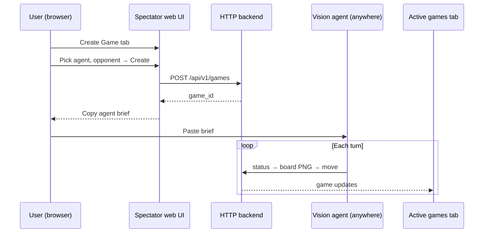

# Plan 1: Public agent API + Create Game (inbound)

Status: **planned**  
Last updated: 2026-07-14  
**Prerequisite:** [Plan 0](00-architecture.md) complete  
**Next plan:** [Plan 2 — Native LLM benchmark](native-llm-benchmark.md)

This is **one self-contained plan**. It includes the HTTP **backend**, the **Create Game** web tab, **deploy** to your home server, and **production hardening**. There is no separate ops or deploy plan to do first.

---

## Goal

Anyone with your URL can register an agent, use **Create Game** to get a copyable brief, and have a vision agent play a full rated game over HTTP. Games feed the shared ladder and appear on the spectator **Active** tab.

---

## What's included (don't do these elsewhere)

| Concern | In this plan? | Phase |
|---------|---------------|-------|
| HTTP API (`/api/v1/...`) | **Yes** | 1 |
| Create Game tab + copyable agent brief | **Yes** | 1 |
| Backend routes → `GameService` (Plan 0) | **Yes** | 1 |
| Deploy: TLS, reverse proxy, process supervisor | **Yes** | 2 |
| Abuse limits, concurrency caps, rate limits | **Yes** | 3 |
| Backup, monitoring, health checks | **Yes** | 4 |

**Local dev vs public:** Phase 1 works on `localhost` (backend + Create Game). Phases 2–4 are required for the real outcome — an agent on another machine hitting your public URL.

---

## Desired outcome: **Create Game** tab

The brief is self-contained: `game_id`, public API base URL, auth, curl loop, vision rules (parity with [`AGENTS.md`](../../AGENTS.md)). Not MCP.

---

## API surface

| Endpoint | Purpose |
|----------|---------|
| `POST /api/v1/agents` | Register agent → API key |
| `GET /api/v1/agents` | List agents |
| `POST /api/v1/games` | Start game |
| `GET /api/v1/games/{id}/board` | PNG only |
| `GET /api/v1/games/{id}/status` | Turn, result — no FEN |
| `POST /api/v1/games/{id}/move` | UCI or SAN |
| `POST /api/v1/games/{id}/resign` | Forfeit |
| `GET /api/v1/games/{id}/pgn` | After game ends |
| `GET /api/v1/leaderboard` | Ratings |
| `GET /health` | Deploy health check |

---

## Phases

### Phase 0 — Design (1–2 days)

- [ ] OpenAPI spec from `agent_surface` contract
- [ ] Auth model (API keys)
- [ ] Agent brief template (matches Create Game copy button)
- [ ] Abuse limit numbers (concurrent games, moves/hour)
- [ ] Deploy layout: Caddy/nginx, TLS, bind `127.0.0.1` + proxy

### Phase 1 — Backend + Create Game (local) (4–6 days)

Build on Plan 0 seams (`/api/v1/` stubs, templates, `GameService`):

**Backend:**

- [ ] Implement Plan 0 stub routes (register agent, games, move, board, status, pgn)
- [ ] API key middleware (fill Plan 0 hook)
- [ ] Integration test: full game over HTTP

**Create Game UI:**

- [ ] Fill `create_game.html` template — form + copy brief button
- [ ] Show `game_id` + **Copy agent brief** (localhost URL in dev)
- [ ] New games on **Active** tab (page refresh / poll is fine)

- [ ] `AGENTS.md` remote section + README

### Phase 2 — Deploy (2–3 days)

Expose the same backend publicly on your home server:

- [ ] `deploy/` — Caddy or nginx config template
- [ ] TLS (Let's Encrypt or Cloudflare Tunnel)
- [ ] systemd / NSSM — auto-restart `play.py serve`
- [ ] Harness binds `127.0.0.1`; only proxy on 443
- [ ] Graceful shutdown + engine cleanup on stop
- [ ] Create Game brief uses **public** base URL
- [ ] Log rotation; disk quota for games dir

### Phase 3 — Production hardening (2–4 days)

- [ ] Config: `max_concurrent_games`, `max_engine_processes`, `max_games_per_hour_per_key`
- [ ] Enforce in middleware + `GameManager`; 429/503 + `Retry-After`
- [ ] Idle game timeout (expose existing config)
- [ ] IP/key rate limiting
- [ ] Metrics: active games, engine count, disk free

### Phase 4 — Backup & monitoring (1–2 days)

- [ ] Nightly tarball: `models.json`, `results.jsonl`, ratings, recent games
- [ ] Restore procedure in README
- [ ] Optional: Uptime Kuma / healthchecks.io ping
- [ ] Alert if engine count exceeds threshold (leak detector)

---

## Success criteria (plan complete)

- [ ] Create Game on **public URL**: copy brief → external agent finishes game via HTTP only
- [ ] Game visible on Active spectator
- [ ] No FEN leaks on agent endpoints (`test_agent_surface.py` parity)
- [ ] 10+ concurrent games, no orphan engines
- [ ] Obvious abuse blocked without manual intervention
- [ ] Leaderboard updates after remote games

---

## Estimate

**~3–4 weeks** one developer (backend + UI + deploy + hardening).

---

## Out of scope (later plans)

- Agent vs agent → [Plan 3](agent-vs-agent.md)
- Browser human moves → [Plan 4](human-vs-agent.md)
- Automated LLM runner → [Plan 2](native-llm-benchmark.md)
- In-app SSE/WebSocket streaming → **not planned** (Twitch)
